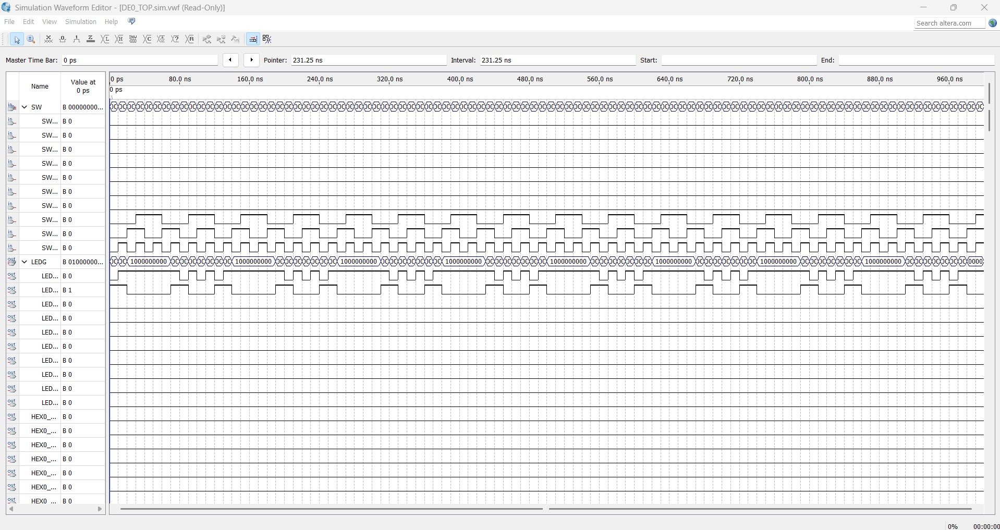

# FPGA Hierarchical Logic Design: 5-to-1 Multiplexer

### Project Overview
This project demonstrates a hierarchical digital circuit design using Verilog HDL. It integrates custom foundational logic gates and a 5-to-1 multiplexer into a top-level module to process multi-bit control signals.

### Core Technologies
* **Hardware Target:** Altera DE0 Development Board (Cyclone III FPGA)
* **Language:** Verilog HDL
* **Tools:** Intel Quartus 2 13.0 Web Edition
* **Concepts:** Hierarchical Design, Continuous & Procedural Assignments, Combinational Logic

### Simulation Results
The logic correctness of the structural design was verified through Quartus Vector Waveform File (VWF) simulation. 

As shown in the waveform above, the output successfully matches the expected truth table across different selection signal combinations.
